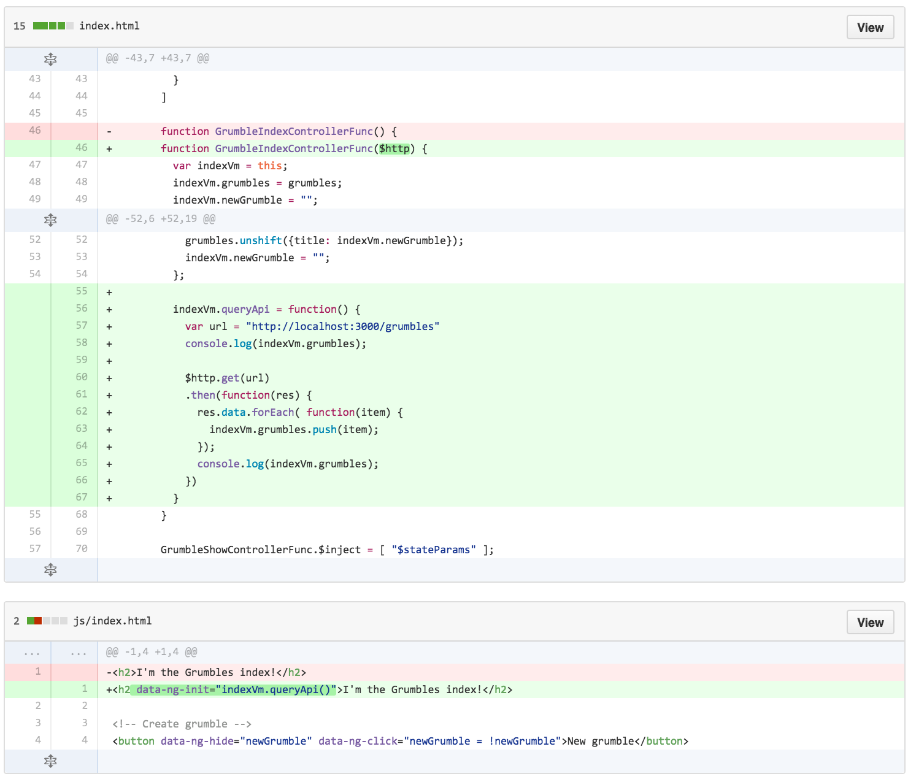
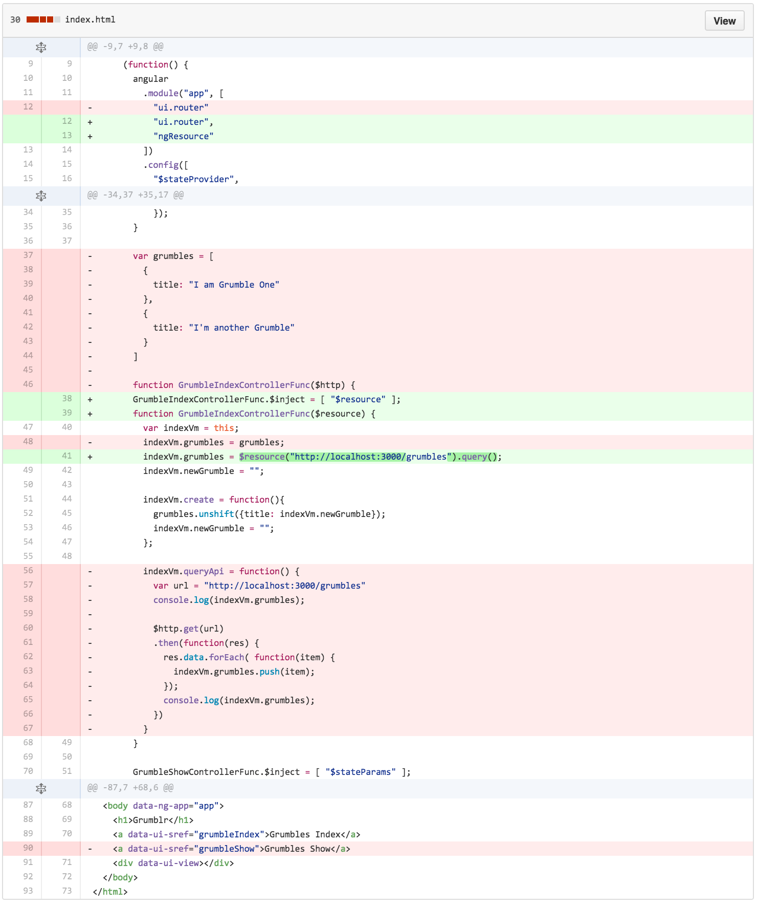
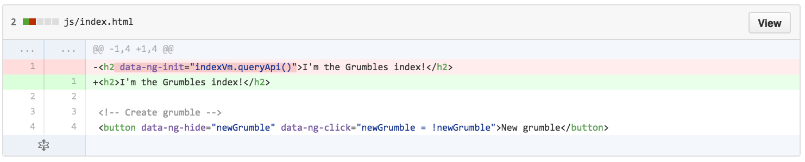
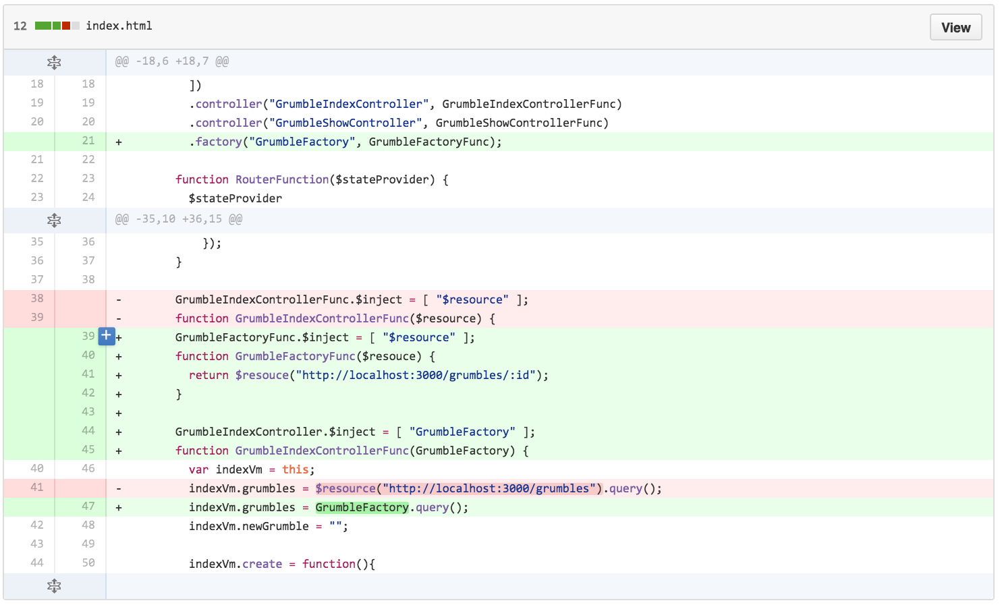
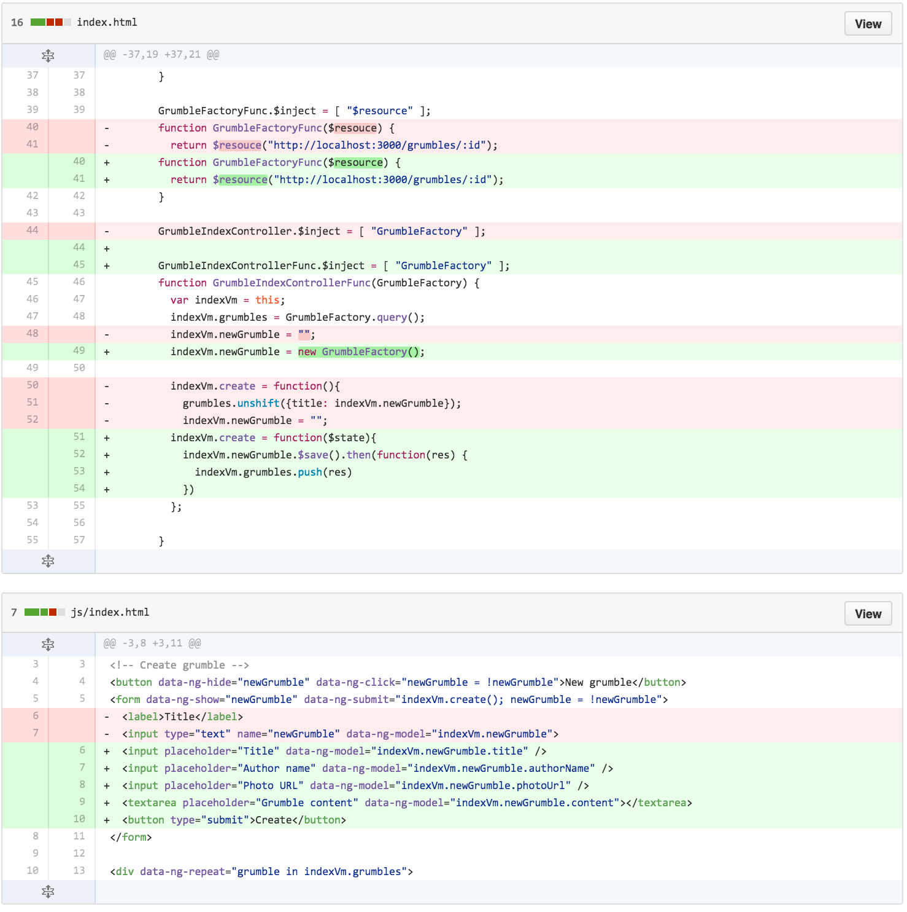
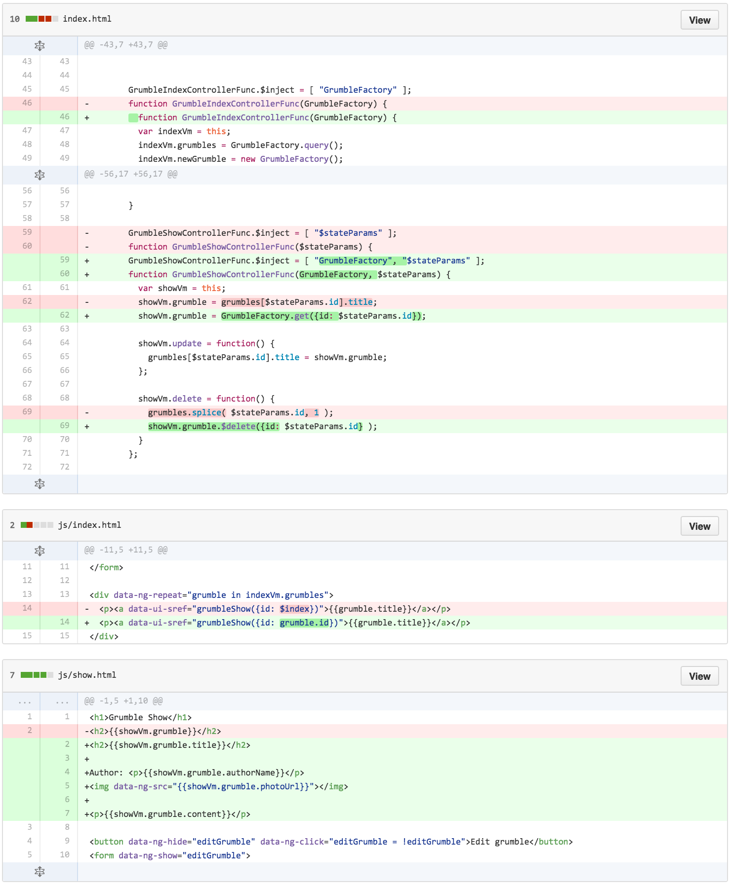
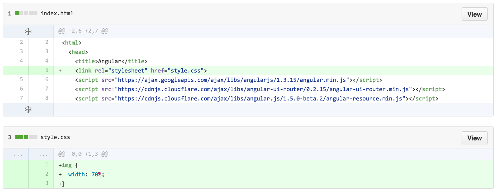
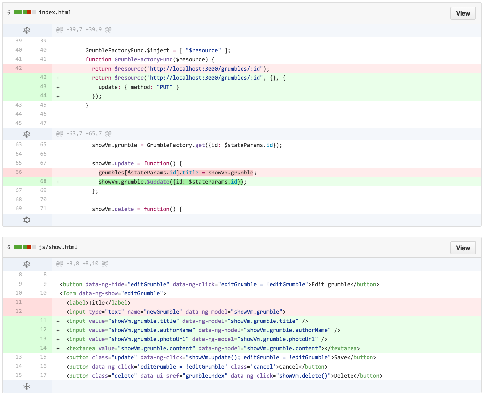

# Factories, Services and `ngResource`

## Screencasts
- Dec 16, 2015 (Robin)
  - [Part 1](https://youtu.be/Ni-KnX9eEDI)
  - [Part 2](https://youtu.be/Jm4lmgpQfJ8)
  - [Part 3](https://youtu.be/dP0YsPTnaTU)
  - [Part 4](https://youtu.be/oEFmmQgh4cE)

## Learning Objectives

* Explain the purpose of and differentiate between Factories and Services in Angular.
* Use `ngResource` to pull information from an API.
* Define multiple controllers in a single module.
* Use $stateParams to access query parameters and update the URL.
* Create separate views and routes for each CRUD action.

## Framing

In the last couple of classes, we've been using hard coded values in our controller to act as our "backend". We probably won't ever do that again. Instead we'll be connecting to an external API using resources and providing an interface to models using factories.


## Walkthrough Current app

Create a new branch with solution from ui.router lesson. You will not be using the code you created in the ui-router class.
```bash
$ git checkout -b factory-resource 2.1.0
```

Also, it doesn't use $locationProvider to remove the hashmark from URLs: all the URLs will be something like /#/grumbles/32. This makes things a bit easier for development: without the hashmark refreshing the page doesn't work, but it does with the hashmark.

## Set Up Grumblr API (5 minutes / 0:25)

Let's start by cloning and running a Grumblr Rails API in the background. Our front-end Grumblr application will make AJAX calls to this API.

```bash
$ git clone git@github.com:ga-wdi-exercises/grumblr_rails_api.git
$ cd grumblr_rails_api
$ bundle install
$ rake db:create
$ rake db:migrate
$ rake db:seed
$ rails s
```
## Add $http for GET grumbles index api data




## Convert to $resouce instead




# Factories and Services

First up, we'll convert the hardcoded data to read from an external API using a factory. A factory, however, is not the only way to accomplish this. Let's see what tools we have at our disposal.

### Factory
A factory is an Angular component that adds functionality to an Angular application. It does this by generating new instances of something. In this case, Grumbles.  

Factories allow us to separate concerns and extract functionality that would otherwise be defined in our controller. We do this by creating an object, attaching properties and methods to it and then returning that object.

Let's start building out a factory in Grumblr. First, create a script file for our factory...

```bash
# From our app's root directory...

$ touch js/grumbles/grumble.factory.js
```

Then let's include our factory file in our main `index.html` file...

```html
<!-- index.html -->

<script src="js/app.js"></script>
<script src="js/grumbles/grumbles.js"></script>
<script src="js/grumbles/index.controller.js"></script>
<script src="js/grumbles/grumble.factory.js"></script>
```

> Note the file naming syntax! Not mandatory but we're choosing to follow [this Angular style guide](https://github.com/johnpapa/angular-styleguide).  

Now let's start building out our factory...

```js
// js/grumbles/grumble.factory.js

"use strict";

(function(){
  angular
    .module( "grumbles" )
    .factory( "GrumbleFactory", [
      GrumbleFactoryFunction
    ]);

  function GrumbleFactoryFunction(){
    return {
      helloWorld: function(){
        console.log( "Hello world!" );
      }
    }
  }
}());
```
> Factories can also take dependencies. In that case, the arguments passed into a factory will look a little different. We'll see that in play when we learn about `ng-resource` later today.

Now we can call it in a controller...

```js
(function(){
  angular
    .module( "grumble" )
    .controller( "GrumbleIndexController", [
      // The factory is passed in as a dependency to our controller.
      "GrumbleFactory",
      GrumbleIndexControllerFunction
    ]);

  function GrumbleIndexControllerFunction( GrumbleFactory ){
    // When `helloWorld` is called on the controller, it runs the function that we defined in our factory.
    GrumbleFactory.helloWorld();
  }
})();
```
> This is nice because it keeps our controller clean. We leave the function declaration(s) to our factory.

### Service

A service achieves the same purpose as a factory. It is instantiated, however, using the `new` keyword. Instead of defining an object and returning it, we attach properties and methods to `this`. Let's recreate the above factory using a service...

```js
(function(){
  angular
    .module( "grumble" )
    .service( "GrumbleService", [
      GrumbleServiceFunction
    ]);

    function GrumbleServiceFunction(){
      this.helloWorld = function(){
        console.log( "Hello world!" );
      }
    }
}());
```

And in our controller...
```js
(function(){
  angular
    .module( "appName" )
    .controller( "GrumbleIndexController", [
      "GrumbleService",
      GrumbleIndexControllerFunction
    ]
  });

  function GrumbleIndexControllerFunction( GrumbleService ){
    GrumbleService.helloWorld();
  }
}());
```

### What's the Difference?

Our controllers look nearly identical in both examples. The difference is in the content of the factory and service. **What do you notice?**

#### Which One Should I Use?

The answer is it doesn't really matter. You might take a look at this "cheat sheet" of what should be used when:

[http://demisx.github.io/angularjs/2014/09/14/angular-what-goes-where.html](http://demisx.github.io/angularjs/2014/09/14/angular-what-goes-where.html)

Great article comparing Factories, Services, & Providers:

[http://tylermcginnis.com/angularjs-factory-vs-service-vs-provider/](http://tylermcginnis.com/angularjs-factory-vs-service-vs-provider/)

## Refactor to use factory for grumble api



Out of the box, this gives us several methods for our newly defined `Grumble` service...

* `Grumble.get`  
* `Grumble.save`  
* `Grumble.query`  
* `Grumble.remove`  
* `Grumble.delete`  

> Where's `update`, you ask? We're going to define that ourselves later on.  

When the data is returned from the server, the response object is an instance of the resource class. The actions `save`, `remove` and `delete` are available on it as methods with the `$` prefix. This allows you to easily perform CRUD operations on server-side data like this...  

## Create with factory



## Add delete feature



## Add simple styles



## Add update feature



## Refactor in separate files

https://github.com/ga-wdi-exercises/grumblr_angular/commit/c77e376b6f341c0473dc41c4abff4e2f264e4ffe

## Exit Ticket

Before you leave, plase take ~3 minutes to complete [this exit ticket.](https://docs.google.com/forms/d/1d03NYFphG6m7yAMUY1OlnJZMQWof7Rt6b5MX3Xn4ZPs/viewform)

This helps us help you! We'll review responses for each exit ticket and start to implement them in future lessons.

### Further Reading

* Angular documentation for [ngResource](https://docs.angularjs.org/api/ngResource) and [$resource](https://docs.angularjs.org/api/ngResource/service/$resource).
* [Angular: What Goes Where?](http://demisx.github.io/angularjs/2014/09/14/angular-what-goes-where.html)
* [Factory vs. Service vs. Provider](http://tylermcginnis.com/angularjs-factory-vs-service-vs-provider/)
* [CRUD with angular resource](http://www.sitepoint.com/creating-crud-app-minutes-angulars-resource/)
